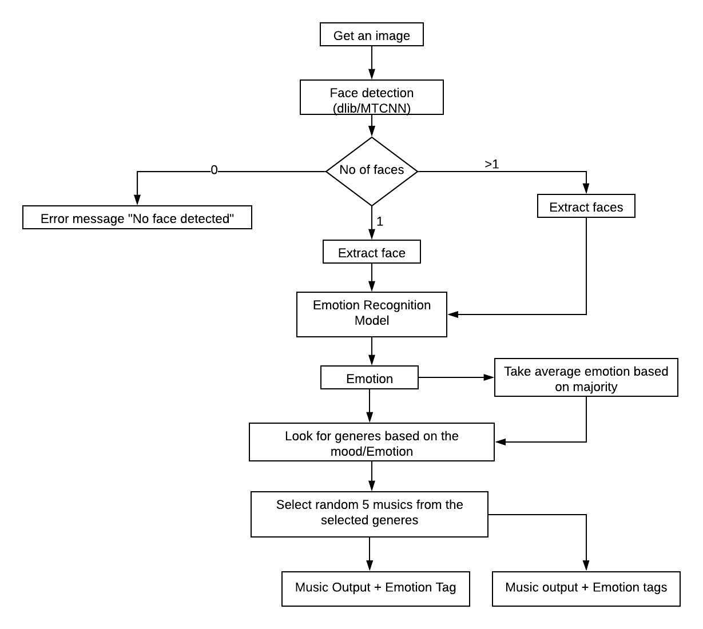

# MOODI-MUSIC
## A system which identifies huuman emotion from an image and suggests music

### Workflow/UML Diagram


### Setup Instructions
Clone this repository and get in it
```
git clone https://github.com/sbrahma0/MOODI-MUSIC.git
cd ./MOODI-MUSIC
```
Install all the dependencies
```
pip install -r requirements.txt 
```
Download the music dataset from the following [link](https://www.kaggle.com/andradaolteanu/gtzan-dataset-music-genre-classification) and place the "Music-Genere" folder inside the repo folder

Run this command
```
streamlit run demo_multiple.py
```
If the browser doesnt not open automatically, copy and paste the web address shown in the terminal.

Once you are in the browser, upload an image and have fun 

