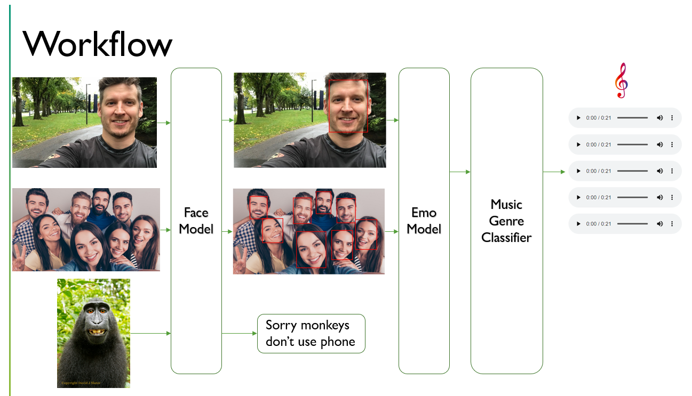

# MOODI-MUSIC
## A system which identifies huuman emotion from an image and suggests music

[](https://opensource.org/licenses/MIT)

On a highlevel this project uses human emotion and music genere dataset to develop a web app that identifies human emotion and recommend music so that users dont have to manually create music playlist.

To use the web app please go the following link [http://54.225.231.32:8501/](http://54.225.231.32:8501/)

Demo Video with all edge cases [Link](https://youtu.be/yELt9uaunPs)

If you have trouble with the above mentioned links, please send an email at sbrahma0@gmail.com

### Workflow Diagram


### Requirements
If you plan to train your own model then you will need the GPU driver and cuda toolkit, else to deploy the app you do not need.
```
NVIDIA GPU
Cuda 10.0
```
### 3rd Party Python Package
MTCNN Python package is a deep learning Face recognition library. It should be noted that versions of MTCNN, Tensorflow and OpenCV are very specificaly compatable. If the versions are not followed there can un-wanted errors.

### Setup Instructions
Downloading the required folders and package installations can take a while, depending on the system and internet speed.
Clone this repository and get in it
```
git clone https://github.com/sbrahma0/MOODI-MUSIC.git
cd ./MOODI-MUSIC
```
Install all the dependencies
```
pip install -r requirements.txt 
```
Download the Emotion recognition model from the following [link](https://drive.google.com/file/d/19su4fmTbqQkLQxQiV1vhOO1zTMQgClc1/view?usp=sharing) and save it in the repository.

Download the music dataset from the following [link](https://www.kaggle.com/andradaolteanu/gtzan-dataset-music-genre-classification) size of 2.4 GB and place the "Music-Genere" folder inside the repo folder.

Run this command
```
streamlit run demo_multiple.py
```
If the browser doesnt not open automatically, copy and paste the web address shown in the terminal.

Once you are in the browser, upload an image and have fun 

### Optional Docker Setup
The Docker will install tensorflow, MTCNN and will occupy 3.5 GB of disk space.Please make sure the model and the music file from GTZAN is added in the repository folder. Downloading the required folders and making the docker image can take a while, depending on the system and internet speed.
```
docker build -t moodi_music .
docker run -p 8501:8501 moodi_music
```
### Training the model
Download FER2013 dataset from the [link](https://www.kaggle.com/deadskull7/fer2013), keep it inside the repository folder and run the following command.
```
python train.py
```


## About Me
#### ACADEMIC JOURNEY
Bachelors in Mechatronics Engineering  >  Masters in Robotics  >  Perception and AI enthusiast


### Copyright <2020> <Sayan Brahma>
```
Permission is hereby granted, free of charge, to any person obtaining a copy of this software and associated documentation files (the "Software"), to deal in the Software without restriction, including without limitation the rights to use, copy, modify, merge, publish, distribute, sublicense, and/or sell copies of the Software, and to permit persons to whom the Software is furnished to do so, subject to the following conditions:

The above copyright notice and this permission notice shall be included in all copies or substantial portions of the Software.

THE SOFTWARE IS PROVIDED "AS IS", WITHOUT WARRANTY OF ANY KIND, EXPRESS OR IMPLIED, INCLUDING BUT NOT LIMITED TO THE WARRANTIES OF MERCHANTABILITY, FITNESS FOR A PARTICULAR PURPOSE AND NONINFRINGEMENT. IN NO EVENT SHALL THE AUTHORS OR COPYRIGHT HOLDERS BE LIABLE FOR ANY CLAIM, DAMAGES OR OTHER LIABILITY, WHETHER IN AN ACTION OF CONTRACT, TORT OR OTHERWISE, ARISING FROM, OUT OF OR IN CONNECTION WITH THE SOFTWARE OR THE USE OR OTHER DEALINGS IN THE SOFTWARE.
```
